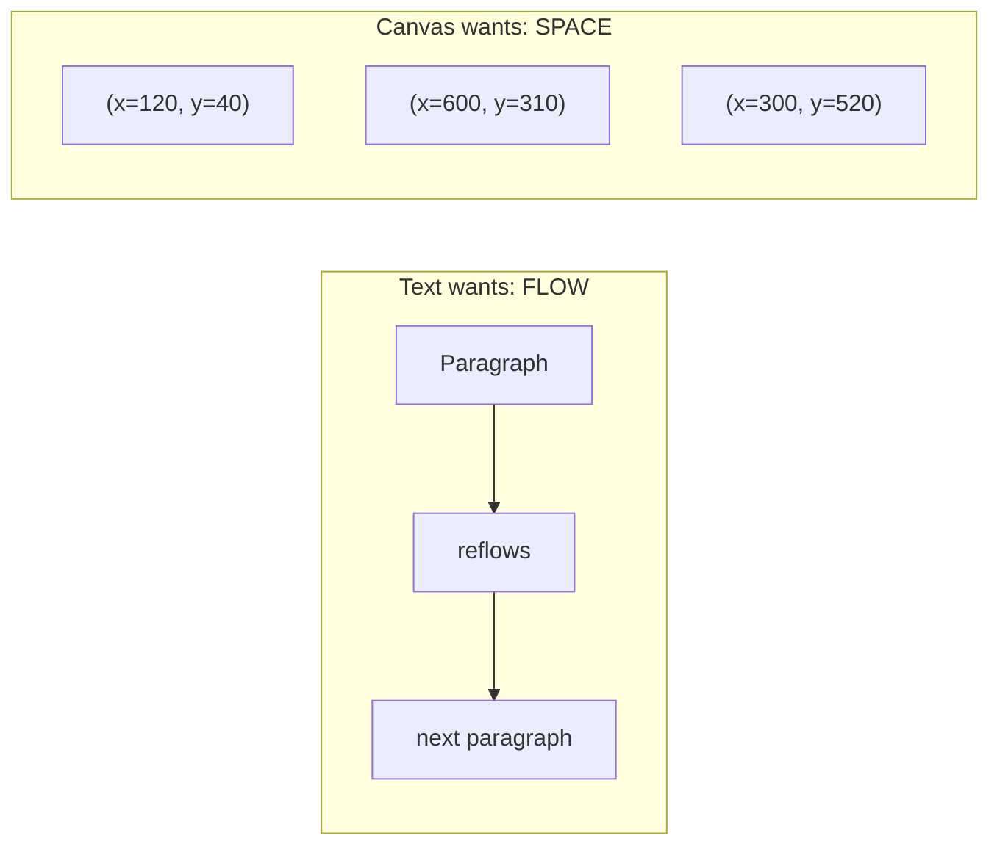
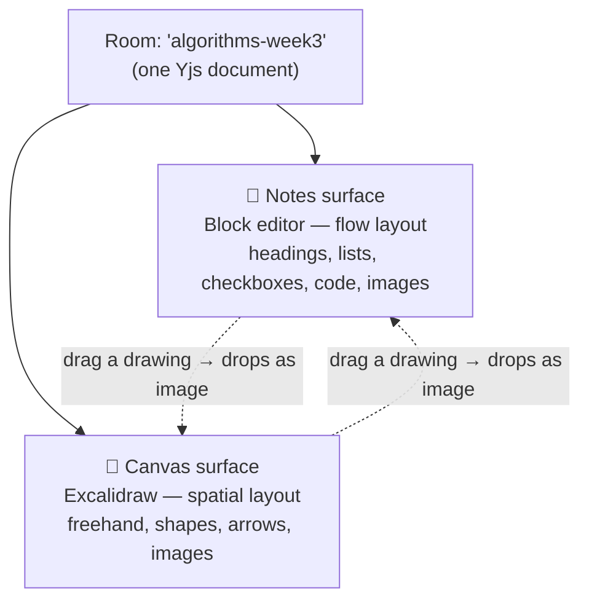

# 00 — IDEA

> The *why*. If we forget everything else, we should remember what's in this file.

## 1. The problem

When a group of students or colleagues works something out together, their thinking splits into two shapes:

- **Words** — definitions, steps, explanations, to-do lists, links, code snippets. Linear, structured, keyboard-driven.
- **Pictures** — diagrams, flows, arrows, sketches, annotated screenshots. Spatial, freeform, mouse-driven.

Today they juggle **two apps**: a Google Doc *and* an Excalidraw/Miro board. Context is split, links go stale, and realtime presence is inconsistent between the two. Excalidraw is brilliant for drawing but a poor text editor; Docs are great for text but can't sketch.

Nobody wants "yet another app." They want **one link** where the group can *both* write *and* draw, together, live.

## 2. The idea in one sentence

**CanVas is a room you join by name where a live document and a live drawing canvas coexist and stay in sync for everyone.**

## 3. Who it's for

| Persona | What they do | What they need |
|---------|--------------|----------------|
| **The Writer** (note-taker of the group) | Types structured notes during a study/work session | A *real* text editor: headings, bullets, checkboxes, code blocks, paste images |
| **The Sketcher** | Thinks by drawing diagrams and arrows | A *real* canvas: freehand, shapes, arrows, text labels, image import |
| **The Skimmer** | Joins late, wants to catch up | Persistence + a shareable link + presence so they know who's around |
| **The Host** | Starts the session, shares the room | Frictionless room creation, no signup for anyone |

Primary context: **classmates and colleagues** — small, trusted, ad-hoc groups (2–10 people).

## 4. The core tension (and our answer)

> "I'm torn between a full canvas and a proper text editor. I want both — but having both ruins both."

This is the defining design problem, so it gets its own section.

### Why "one surface for both" fails

Text and canvas have **opposite fundamental layouts**:

- Text is a **document**: content has an order, reflows when the window resizes, and is navigated with the keyboard.
- Canvas is a **plane**: content has absolute coordinates, never reflows, and is navigated with the mouse/trackpad.

If you put rich text *inside* an infinite canvas, you get **sticky notes** — fine for a label, useless for writing three paragraphs with headings. If you put drawing *inside* a document, you get **inline clip-art** — fine for one figure, useless for a sprawling diagram. Each compromises the other. That's the "ruins both" the user felt.

### Our answer: two surfaces, one synchronized room

Keep **two purpose-built surfaces**, but bind them into **one shared, realtime, persisted room**:

- You **switch** between Notes and Canvas with a tab (or a split view on a wide screen).
- **Different people can be on different surfaces at the same time** — the note-taker writes while the sketcher draws, and both see the presence/updates.
- Both surfaces are stored in the **same underlying document**, so a room is genuinely "notes + drawing," not one or the other.
- **The bridge:** you can drop a picture into either surface, and (later) export a canvas selection *as an image into the notes*. That's how "the best of both worlds" actually touches — pictures are the shared currency between the two.

### Why this is achievable (not just nice)

The reason this isn't a fantasy: the best-in-class open-source libraries for each surface **both already speak the same realtime language (Yjs)**.

- **BlockNote** (text) → native Yjs collaboration.
- **Excalidraw** (canvas) → exposes the hooks we need to bind it to Yjs.

So "one synchronized room with two surfaces" is a matter of putting two Yjs-aware editors into one Yjs document — not inventing a new editor. See [LOGIC](./04-LOGIC.md).

## 5. What makes it feel great

- **Zero friction to start:** type a room name → you're in. Share the URL → they're in.
- **It's alive:** cursors move, names float, the presence dots update. It *feels* collaborative, which is the whole point.
- **It remembers:** close the tab, come back next week, everything's there.
- **It respects both kinds of thinker:** the writer never fights the canvas; the sketcher never fights the doc.

## 6. Explicit non-goals (at least for now)

Saying "no" is how we ship. We are **not** building:

- Accounts, orgs, permissions, or roles (open rooms, anonymous names).
- Voice/video chat.
- Version history / time-travel (Yjs gives us a foundation for it *later*).
- Mobile-native apps (responsive web only).
- A Miro-scale infinite-whiteboard-of-whiteboards; one canvas per room is plenty.
- Offline-first / local-first installs (though Yjs makes this a natural later step).

## 7. How we'll know it worked

- A group of classmates uses it for a real session **without being told how**.
- Two people edit the same note paragraph and the same drawing region at once, and **nothing breaks or gets lost**.
- Someone reopens a week-old room and it's exactly as they left it.
- It runs at **$0/month** for our scale.

## 8. The name

**CanVas** — "canvas" for the drawing soul of it, with the capital **V** nodding to the fact that it's more than a canvas: it's a place to *write* and *draw* together.

---

Next: [01 — SPEC](./01-SPEC.md), where this vision becomes concrete, testable requirements.
