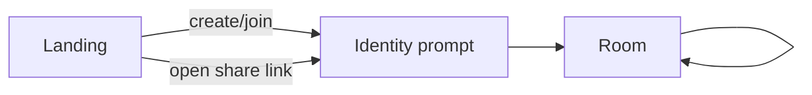
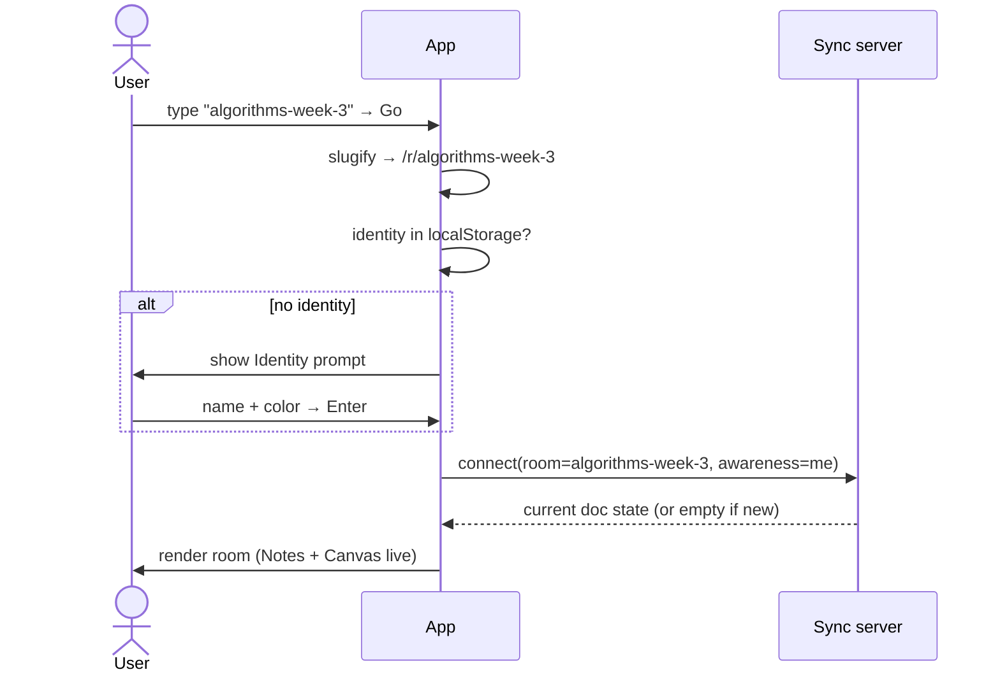
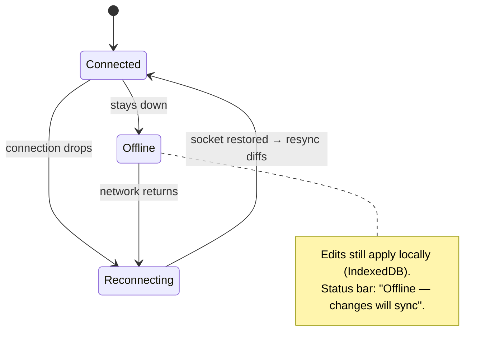

# 02 — DESIGN

> The *how it feels*. Screens, flows, layout, and the interaction model for the two-surface room. ASCII wireframes over pixel-perfect mocks — this is a blueprint, not a Figma export.

## 1. Design principles

1. **Frictionless in, everything visible.** No signup wall, no empty-state confusion. You should understand the whole app in 5 seconds.
2. **Two surfaces, one room, one presence.** Switching Notes ↔ Canvas must feel like turning a page in the *same* notebook, never like opening a different app.
3. **Alive by default.** Cursors, presence dots, and edits are always moving. Collaboration is the product; show it.
4. **Get out of the way.** The content (notes/drawing) is the hero. Chrome is thin, quiet, and collapsible.
5. **Honest states.** Connecting, reconnecting, offline, saved — always tell the truth about sync status, calmly.

## 2. Visual language

- **Feel:** clean, light, slightly playful (it's for classmates). Excalidraw's hand-drawn warmth sets the tone; the rest of the UI stays crisp and neutral so it doesn't fight the canvas.
- **Color:** neutral gray UI shell; **user colors** (from a curated ~12-color palette) are the accent system — cursors, presence dots, selection highlights, chat name tags all use the person's color. Color = identity, consistently, everywhere.
- **Typography:** one clean sans (e.g. Inter) for UI and Notes body; a monospace for code blocks. Excalidraw keeps its own hand-drawn font for canvas text.
- **Density:** comfortable, not cramped. Big tap targets for the entry flow; tool density only inside the editors themselves.
- **Motion:** subtle. Cursors interpolate smoothly (see LOGIC §cursor smoothing); panels slide; respect `prefers-reduced-motion`.
- **Dark mode [SHOULD]:** both surfaces support it; ship light first.

## 3. Screen map



Just two screens: **Landing** and **Room** (with an **Identity** step layered in front of the room the first time). Deliberately tiny surface area.

## 4. Landing screen

Purpose: get into a room in one action.

```
┌───────────────────────────────────────────────────────────┐
│                                                             │
│                        CanVas                               │
│           write + draw together, in realtime                │
│                                                             │
│   ┌─────────────────────────────────────────────────┐      │
│   │  Room name                                        │      │
│   │  ┌───────────────────────────────┐  ┌─────────┐  │      │
│   │  │ e.g. algorithms-week-3        │  │  Go →   │  │      │
│   │  └───────────────────────────────┘  └─────────┘  │      │
│   │                                                   │      │
│   │  [ 🎲 Surprise me ]     no account needed         │      │
│   └─────────────────────────────────────────────────┘      │
│                                                             │
│   Type any name. If it exists you'll join it,               │
│   if it doesn't you'll create it.                           │
│                                                             │
└───────────────────────────────────────────────────────────┘
```

- Single field. One button. Enter key submits.
- **"Surprise me"** generates a friendly random slug (e.g. `brave-otter-canvas`) for when you just want a fresh space — this is our answer to slug collisions without adding rules.
- Micro-copy makes the create-or-join duality explicit (FR-A2/A4) so the shared-name behavior never surprises anyone.
- No room list, no history of past rooms in MVP (privacy, NFR-7). *(A local "recent rooms" list is a nice [LATER].)*

## 5. Identity prompt

Shown the first time you enter a room (or when localStorage has no identity). Non-blocking-feeling, one step.

```
┌─────────────────────────────────────────┐
│  You're joining:  algorithms-week-3      │
│                                          │
│  Your name                               │
│  ┌────────────────────────────────┐      │
│  │ Sayan                          │      │
│  └────────────────────────────────┘      │
│                                          │
│  Your color                              │
│  ● ● ● ● ● ● ● ● ● ● ● ●   (pick one)     │
│                                          │
│              [ Enter room → ]            │
└─────────────────────────────────────────┘
```

- Pre-fills name+color from localStorage if present (FR-B3); auto-picks a color otherwise (FR-B4).
- This is the *only* gate, and it's 2 fields with sensible defaults — effectively "press Enter."

## 6. Room screen — the core

### 6.1 Anatomy

```
┌───────────────────────────────────────────────────────────────────────┐
│ CanVas · algorithms-week-3        [📝 Notes | 🎨 Canvas | ⇹ Split]   ● ● ●  🔗 Share │  ← Top bar
├──────────────────────────────────────────────────────────┬────────────┤
│                                                            │ PRESENCE   │
│                                                            │ ● Sayan(you)│
│                                                            │ ● Aria     │
│                 ACTIVE SURFACE                             │ ● Rk       │
│           (Notes editor  OR  Canvas)                       ├────────────┤
│                                                            │ CHAT       │
│                                                            │ Aria: yo   │
│                                                            │ Sayan: 1s  │
│                                                            │ ┌────────┐ │
│                                                            │ │type... │ │
│                                                            │ └────────┘ │
├──────────────────────────────────────────────────────────┴────────────┤
│  ✓ Saved · 3 online · reconnecting… (only when relevant)                │  ← Status bar
└───────────────────────────────────────────────────────────────────────┘
```

- **Top bar:** app + room name · **surface switcher** (Notes / Canvas / Split) · presence dots (compact) · **Share** button (copies link, US-19).
- **Right rail (collapsible):** Presence list (US-15) on top, Chat (US-18) below. Collapses to icons on narrow screens; chat shows an unread badge when collapsed (FR-E4).
- **Status bar:** honest sync state — `Saved` / `Saving…` / `Reconnecting…` / `Offline — changes will sync` (NFR-6, principle 5).
- **Center:** the active surface. This is 80%+ of the pixels.

### 6.2 The surface switcher — the heart of the "both worlds" UX

```
[ 📝 Notes ]  [ 🎨 Canvas ]  [ ⇹ Split ]
```

- **Notes / Canvas:** swap the center region. Instant, no reload; the other surface stays live in the background (still receiving updates), you just aren't looking at it.
- **Split [SHOULD, US-17]:** on wide screens, show both side-by-side with a draggable divider. This is where "write + draw together" becomes literal — the note-taker and sketcher can watch each other.

```
 SPLIT VIEW (wide screens)
┌────────────────────────────┬────────────────────────────┐
│  📝 NOTES                   │  🎨 CANVAS                  │
│  # Dijkstra                 │        ○───▶○               │
│  - [ ] prove greedy choice  │       /       \             │
│  - [x] relax edges          │      ○────────▶○            │
│  ```py                      │                             │
│  dist[v] = ...              │     (Aria is drawing…)      │
│  ```                        │                             │
└────────────────────────────┴────────────────────────────┘
     ↑ Sayan typing here          ↑ Aria drawing here, same room
```

- Your **active surface** is part of your awareness state (FR-E1), so presence can show *where* people are: `● Aria — on Canvas`. Nice touch that reinforces "one room."

### 6.3 Notes surface

- A block editor (BlockNote look-and-feel): slash `/` menu to insert blocks, drag handles to reorder, markdown shortcuts (`#`, `-`, `[]`, ` ``` `).
- **Remote presence in text (US-9/FR-C3):** other people's carets appear as thin colored bars with a small name flag; their selections highlight in a translucent version of their color.
- **Images (US-8):** paste or `/image`; renders inline; stored as a blob reference (FR-C4/F1).
- Empty state: a friendly placeholder — `Type "/" for blocks, or just start writing…`.

### 6.4 Canvas surface

- Full Excalidraw embed (FR-D1): its native left toolbar (shapes, arrow, text, freehand, image, eraser), top-left menu, zoom controls.
- **Remote cursors (US-13/FR-D4):** rendered through Excalidraw's built-in collaborator pointers — a colored arrow + name flag that moves smoothly.
- **Remote edits (US-11):** shapes others create/move/delete appear live; your in-progress drag is never interrupted (FR-D3, see LOGIC).
- **Images (US-12):** paste or the image tool; stored as blob reference by `fileId` (FR-D6/F1).
- **Export (US-14):** an export control → PNG / SVG via Excalidraw utilities.
- Empty state: Excalidraw's own hint, plus a subtle "others' cursors will show up here."

### 6.5 Presence & chat rail

```
┌──────────────┐
│ IN THIS ROOM │
│ ● Sayan (you)│   ← your color dot
│ ● Aria · 🎨   │   ← on Canvas
│ ● Rk · 📝     │   ← on Notes
├──────────────┤
│ CHAT      [–]│
│ ┌──────────┐ │
│ │Aria: ready?│ │
│ │Sayan: yep │ │
│ └──────────┘ │
│ ┌──────────┐ │
│ │ message… │ │
│ └──────────┘ │
└──────────────┘
```

- Presence updates within seconds of join/leave (FR-E2).
- Chat is persisted with the room (FR-E3), so late-joiners see history.
- Names in chat are tagged with the user's color = consistent identity everywhere.

## 7. Key flows

### 7.1 Create-or-join



Create and join are the *same* path; "new" just means the server has no snapshot yet.

### 7.2 A live edit (optimistic)

```mermaid
sequenceDiagram
  actor Me
  participant MyDoc as My Yjs doc
  participant WS as Sync server
  participant Peer as Peer Yjs doc
  Me->>MyDoc: draw rectangle / type text
  MyDoc-->>Me: render immediately (no wait)
  MyDoc->>WS: send update (binary diff)
  WS->>Peer: broadcast update
  Peer-->>Peer: merge (CRDT) → render
  Note over MyDoc,Peer: both converge; see LOGIC for the guarantee
```

The user **never waits for the server** to see their own action (NFR-2).

### 7.3 Reconnect / offline (honest states)



## 8. Responsive behavior

- **Wide (desktop):** Split view available; right rail expanded.
- **Medium (small laptop/tablet):** one surface at a time; rail collapsible.
- **Narrow (phone, best-effort):** surface switcher becomes a bottom tab bar; rail becomes slide-over sheets for Presence and Chat; Excalidraw in its compact mode. Not a priority (NFR-9) but shouldn't be broken.

```
 NARROW
┌───────────────┐
│ room name   ●●│
│               │
│  ACTIVE       │
│  SURFACE      │
│               │
│               │
├───────────────┤
│ 📝  🎨  👥  💬 │  ← bottom tabs
└───────────────┘
```

## 9. Micro-interactions worth getting right

- **Cursor smoothing:** interpolate remote cursor positions between updates so they glide, not teleport (feels 10× more alive; see LOGIC §throttling).
- **Join/leave:** a quiet toast — `Aria joined` — and the presence dot fades in.
- **Share:** button copies link and briefly flips to `✓ Copied`.
- **Saved indicator:** debounced; flicks to `Saving…` then settles to `✓ Saved` so people trust persistence.
- **Color as identity:** the same color follows a person across cursor, presence dot, text caret, and chat tag — never randomized per surface.

## 10. Accessibility (NFR-8)

- Entry flow fully keyboard-operable; visible focus rings.
- Palette colors chosen for contrast and to be distinguishable for common color-vision deficiencies; presence/chat always pair color **with a name**, never color alone.
- Respect `prefers-reduced-motion` (disable cursor interpolation / panel animations).
- Excalidraw and BlockNote bring their own a11y baselines; we don't regress them.

## 11. Design open questions (to revisit, not blocking)

- Split view default ratio and whether it's remembered per user.
- Whether "activeSurface" in presence is too noisy or a nice signal (ship it, watch reactions).
- Dark mode timing (ship light, add dark once both surfaces are stable).

---

Next: [03 — TECH](./03-TECH.md), where we choose the concrete stack and the **free** infrastructure to run all of this.
