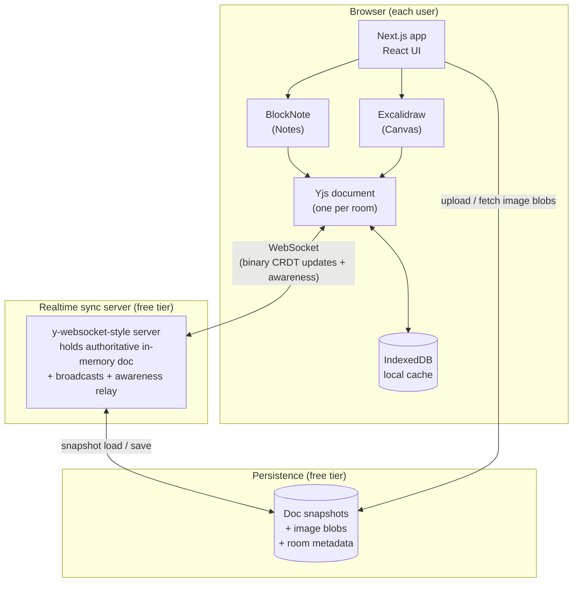
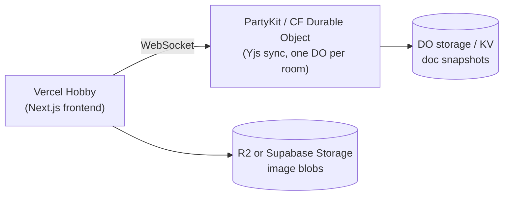
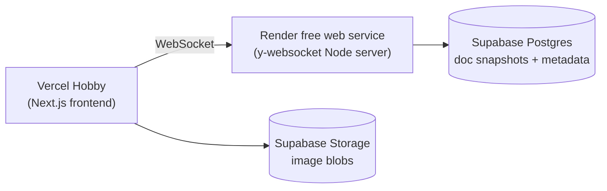

# 03 — TECH

> The *how it's built*. Architecture, the concrete stack, the data model, and — because budget is **$0** — a careful, honest tour of **free-tier hosting** with a clear recommendation.

## 1. Architecture at a glance



Three moving parts:

1. **Frontend** — a Next.js app served statically-ish; runs the two editors + the Yjs doc + local cache.
2. **Sync server** — a small always-on WebSocket process that relays Yjs updates between clients and holds the live authoritative doc.
3. **Persistence** — durable storage for doc snapshots, image blobs, and room metadata.

> The key architectural fact that drives every hosting decision: **Yjs sync needs a stateful, always-on WebSocket connection.** That does *not* fit classic serverless functions (which are short-lived and stateless). This is why we can't "just deploy to Vercel" and be done — see §5.

## 2. Frontend stack

| Concern | Choice | Why |
|---------|--------|-----|
| Framework | **Next.js (App Router), React, TypeScript** | Your pick; great DX; free Vercel deploy; SSR for the landing page, client components for the editors. |
| Canvas | **`@excalidraw/excalidraw`** | Reuse the whole engine (decision locked). Loaded client-side only (`dynamic(..., { ssr: false })`). |
| Notes | **BlockNote** (on TipTap/ProseMirror) | Block editor with **native Yjs collaboration** + built-in remote-cursor support. Least custom code for real collab text. |
| CRDT | **Yjs** + `y-protocols` (awareness) | The shared document model both editors bind to. |
| Transport | **`y-websocket`-compatible provider** | Standard Yjs WebSocket provider; server side can be the reference server or PartyKit (§5). |
| Local cache | **`y-indexeddb`** | Instant loads + offline edits (FR-G4, US-21). |
| State/UI | React + a light store (Zustand) | Presence list, chat, connection status, active surface. |
| Styling | Tailwind CSS | Fast, consistent, tiny. |

### Why two editors can share one Yjs doc
A single `Y.Doc` can hold multiple named shared types. We give each surface its own root type inside the same doc:

- `doc.getXmlFragment("notes")` → bound to BlockNote.
- `doc.getMap("canvas")` (elements) + related maps → bound to Excalidraw (see [LOGIC](./04-LOGIC.md)).
- `doc.getArray("chat")` → chat log.

One doc = one room = one sync channel = one snapshot. Clean.

## 3. Sync server

We deliberately keep the server **dumb**: it does *not* understand shapes or text. It only:

1. Accepts WebSocket connections scoped to a `room` id.
2. Keeps the authoritative `Y.Doc` for each active room in memory.
3. Relays incoming binary updates to all other peers in that room (the Yjs sync protocol).
4. Relays **awareness** (cursors/presence) — ephemeral, never persisted.
5. Persists/loads the doc **snapshot** to/from storage (debounced; on last-leave; on cold start).

Because it's dumb, it's tiny, cheap, and identical regardless of what the surfaces contain. Two implementation shapes (both fine):

- **Reference `y-websocket` server** (a small Node process). Easiest to reason about; run on Render/Fly.
- **PartyKit / Cloudflare Durable Object** running a Yjs backend (`y-partyserver`). Purpose-built for this; best free realtime story.

See §5 for which to pick.

## 4. Data model

### 4.1 Inside the Yjs doc (per room) — the collaborative, persisted state

```
Y.Doc (room)
├─ notes   : Y.XmlFragment      // BlockNote content
├─ canvas  : Y.Map              // Excalidraw elements, keyed by element.id
│     └─ <elementId> : Y.Map    // {type,x,y,w,h,points,...} mirrored from Excalidraw
├─ canvasFiles : Y.Map          // fileId → {url, mimeType, w, h}  (image references)
├─ chat    : Y.Array<Y.Map>     // {id,userId,name,color,text,ts}
└─ meta    : Y.Map              // {displayName, createdAt, ...} room metadata
```

- **Note:** binary image data is **never** in here (FR-F1). Only references/URLs. This keeps the CRDT small and sync fast.

### 4.2 Awareness (per connection) — ephemeral, NOT persisted

```
awareness.state = {
  user:          { id, name, color },
  cursor:        { surface: "canvas"|"notes", x, y } | null,
  activeSurface: "notes" | "canvas",
  selection:     <editor-specific, optional>
}
```

Awareness is diffed and broadcast continuously (throttled) and dropped the moment you disconnect → that's how presence (FR-E2) and live cursors (FR-D4) work. Details in [LOGIC](./04-LOGIC.md).

### 4.3 Durable storage — three buckets

| Bucket | Contents | Shape |
|--------|----------|-------|
| **Snapshots** | The encoded Yjs doc state per room | `room_snapshots(room_id PK, ydoc BYTEA, updated_at)` (Postgres) *or* a key per room in KV/object storage. |
| **Image blobs** | Uploaded pictures | Object storage; public-read URL referenced from the CRDT. |
| **Room metadata** *(optional MVP)* | Display name, created/last-active | `rooms(room_id PK, display_name, created_at, last_active_at)`; useful for cleanup jobs. |

We store a **snapshot** (the whole doc encoded via `Y.encodeStateAsUpdate`) rather than an ever-growing log of updates. Simpler and bounded. *(An append-log with periodic compaction is a [LATER] optimization.)*

## 5. Hosting on **$0** — the honest guide

You asked for this explained, so here's the real picture, not marketing.

### 5.1 The core constraint

- The **frontend** is easy and truly free forever (static + a little SSR).
- The **sync server needs to stay running and hold WebSocket connections**. "Free always-on" is the scarce resource. There are three realistic strategies, below.
- **Storage** (a bit of Postgres + some object storage) is comfortably free at our scale.

### 5.2 Component-by-component free tiers

| Component | Option | Free tier reality (as of 2026) | Verdict |
|-----------|--------|-------------------------------|---------|
| Frontend | **Vercel Hobby** | Free for personal/non-commercial; generous bandwidth; auto-deploy from Git. | ✅ Use it. |
| Frontend (alt) | **Cloudflare Pages / Netlify** | Also free; fine alternatives. | ✅ Backup. |
| Sync server | **Cloudflare Workers + Durable Objects** (via **PartyKit** / `y-partyserver`) | Workers free plan includes a daily request allowance; **Durable Objects are on the free plan**. Designed for exactly this (stateful, per-room, WebSocket). **No cold-sleep spin-down like a free web service.** | ✅ **Recommended.** |
| Sync server (alt) | **Render free web service** | Free, WebSockets supported, but **spins down after ~15 min idle** → cold start (a few seconds) on next visit. Fine for a hobby/classmate tool. | ✅ Simplest Node path; accept cold starts. |
| Sync server (alt) | **Fly.io** | Small VMs can run near-free but now generally require a card; can auto-stop/start machines. | ⚠️ OK, more setup. |
| Persistence (DB) | **Supabase free** | Postgres (ample MB), REST/JS client, generous rows. You already have it available. | ✅ **Recommended** for snapshots + metadata. |
| Persistence (blobs) | **Supabase Storage** | Free storage bucket, public URLs. One place for DB + files. | ✅ Use for images. |
| Persistence (alt) | **Cloudflare KV + R2** | If we go all-Cloudflare, store snapshots in KV/DO storage and images in R2 (free tier). | ✅ Natural if using PartyKit. |

### 5.3 Two clean, fully-free blueprints

**Blueprint A — "All-Cloudflare realtime" (recommended for best free realtime):**



- Pros: no cold-sleep, per-room isolation for free, scales smoothly, purpose-built.
- Cons: Durable Objects mental model is new; snapshot code is CF-specific.

**Blueprint B — "Node + Supabase" (recommended for simplest to understand):**



- Pros: plain Node `y-websocket` server (tons of examples), Supabase is friendly and you have it.
- Cons: Render free **cold-starts after idle** — first person to open a sleepy room waits a few seconds while it wakes and reloads the snapshot. Mitigated by IndexedDB (they see local content instantly) and an honest "reconnecting…" state.

### 5.4 Recommendation

- **Start with Blueprint B** (Node `y-websocket` on Render + Supabase). It's the easiest to *understand* — which matters because you said you want to learn every layer — and everything is inspectable/plain.
- **Graduate to Blueprint A** (PartyKit/Durable Objects) if/when Render's cold-starts annoy you or you want it to feel truly always-on. The client code barely changes (still a Yjs WebSocket provider), so this migration is low-risk.

Both are **$0** at 2–10 users per room. Neither requires a credit card for the core path (double-check current signup terms when you deploy).

### 5.5 Cold-start UX (because free = trade-offs)
When the sync server is asleep (Blueprint B):
1. User opens room → Yjs loads **instantly from IndexedDB** (they see last-known content).
2. Status bar shows `Reconnecting…`.
3. Server wakes (~1–5 s), loads snapshot, WebSocket connects, diffs reconcile.
4. Status bar → `✓ Saved`. The user was never blocked.

This is why the local cache (FR-G4) isn't optional — it's what makes a free, sleepy backend feel fine.

## 6. Environments & config

- **Local dev:** `next dev` + the Node `y-websocket` server on `localhost` + a local Supabase (or the hosted free project). One `.env.local`.
- **Prod:** Vercel (frontend) + Render/PartyKit (sync) + Supabase (storage).
- **Env vars (indicative):** `NEXT_PUBLIC_SYNC_URL` (wss://…), `NEXT_PUBLIC_SUPABASE_URL`, `NEXT_PUBLIC_SUPABASE_ANON_KEY`, `SUPABASE_SERVICE_ROLE` (server-side snapshot writes only).

## 7. Repository shape (proposed)

```
CanVas/
├─ docs/                     ← you are here
├─ apps/
│  ├─ web/                   ← Next.js frontend
│  │  ├─ app/                ← routes: / (landing), /r/[room]
│  │  ├─ components/         ← Room, NotesSurface, CanvasSurface, PresenceRail, Chat
│  │  ├─ lib/yjs/            ← doc factory, providers, awareness, bindings
│  │  └─ lib/storage/        ← Supabase client, image upload
│  └─ sync/                  ← the WebSocket server (Node) OR party/ for PartyKit
├─ packages/
│  └─ shared/                ← shared types (Identity, ChatMessage, awareness shape)
├─ package.json              ← workspaces (pnpm/npm)
└─ README.md
```

Monorepo (pnpm workspaces) so the frontend and sync server can share the `shared` types package. Keeps the awareness/chat/identity shapes identical on both ends.

## 8. Third-party dependencies (indicative)

- `next`, `react`, `typescript`, `tailwindcss`
- `yjs`, `y-protocols`, `y-websocket`, `y-indexeddb`
- `@excalidraw/excalidraw`
- `@blocknote/core`, `@blocknote/react` (+ its Yjs collaboration extension)
- `zustand`
- `@supabase/supabase-js`
- (Blueprint A) `partykit` / `y-partyserver`

Pin exact versions at install time; don't hand-guess version numbers.

## 9. Security / abuse posture (MVP-honest)

- Rooms are open (FR-A3). Anyone with the name/link can read+write. This is fine for trusted small groups; **it is not a security boundary.** Documented in SPEC risks and NFR-7.
- Image uploads: validate mime/size client-side **and** constrain the storage bucket (size caps, allowed types) so an open room can't be used as free file hosting at scale.
- No secrets in the client beyond the Supabase **anon** key (safe by design with proper bucket rules). Snapshot writes use a service role **only on the sync server**, never in the browser.
- Rate-limit chat + uploads lightly on the server to blunt spam.
- Passwords/locked rooms and real auth are [LATER].

---

Next: [04 — LOGIC](./04-LOGIC.md) — the deep, teaching-oriented core: how CRDTs guarantee everyone converges, how Yjs works, and how we bind a canvas and a text editor to it without losing anyone's edits.
