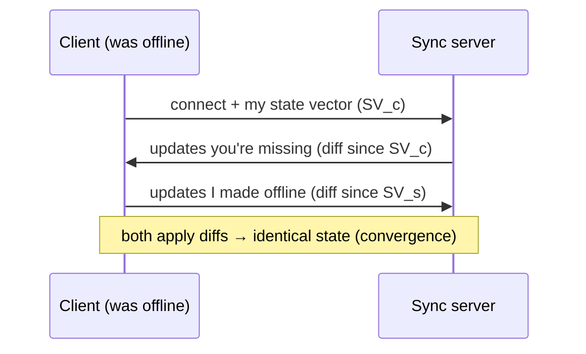
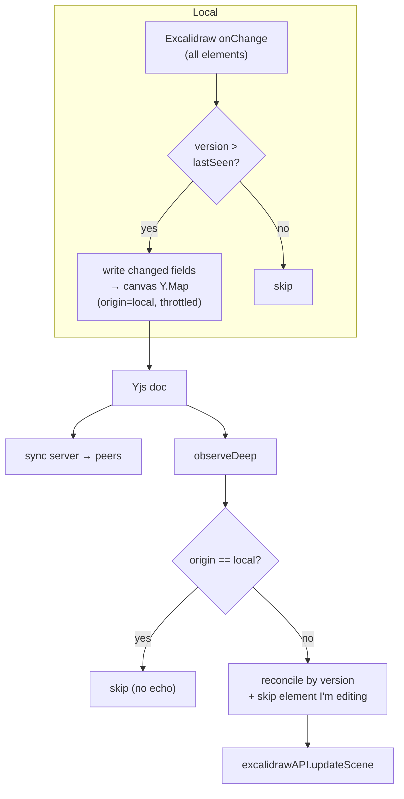
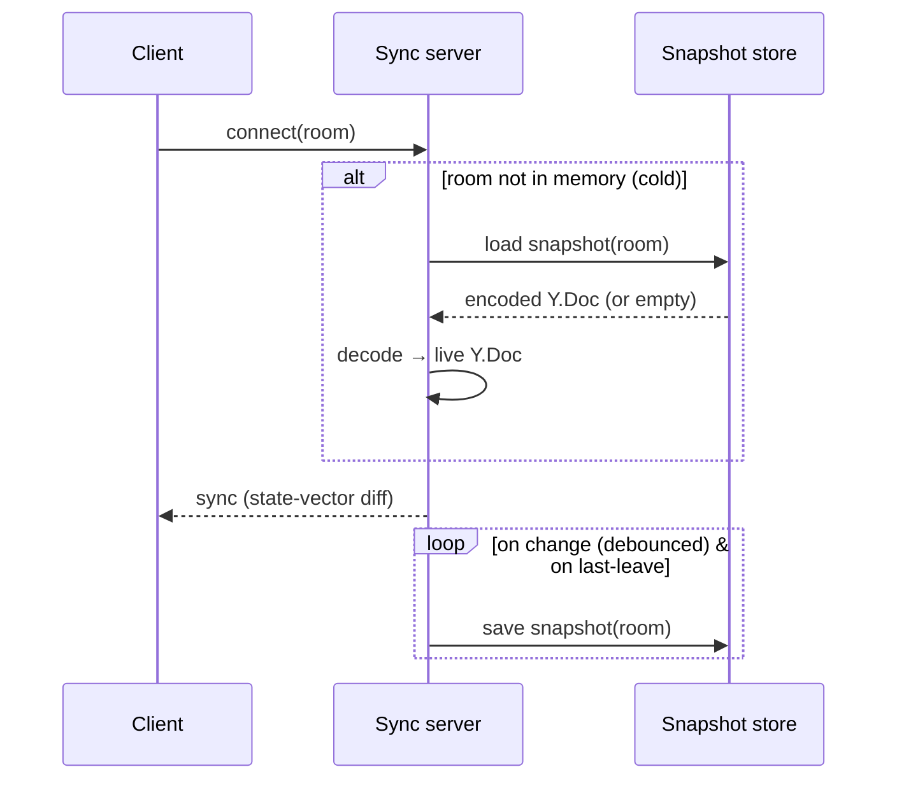

# 04 — LOGIC

> The *how it actually works*, taught from first principles. This is the hard part you were worried about. We'll build intuition before touching APIs, so that when the code exists you understand *why* it's shaped the way it is.

**Roadmap of this doc:**
1. Why realtime collaboration is genuinely hard (the naive approach and how it explodes).
2. Two solutions to the hard part: OT vs CRDT — and why we pick CRDT.
3. CRDT intuition without the scary math.
4. Yjs concretely: updates, state vectors, shared types, transactions.
5. Awareness: cursors & presence (the ephemeral side-channel).
6. Binding **BlockNote** to Yjs (the easy surface).
7. Binding **Excalidraw** to Yjs (the hard surface) — the crux of this whole project.
8. Cursors: throttling & smoothing so it feels alive.
9. Persistence: snapshots, cold starts, offline.
10. Edge cases & failure modes, enumerated.

---

## 1. Why this is hard — the naive approach and its explosion

Let's feel the problem first. Imagine the simplest possible design: **"whenever anything changes, send the whole state to everyone."**

Two users, one canvas:

```
t0: canvas = [rectA]
t1: Alice adds circleB     → Alice sends [rectA, circleB]
t1: Bob   moves rectA      → Bob   sends [rectA']
```

Both messages are in flight at the same time. What does each receive?

- Alice receives Bob's `[rectA']` → her canvas becomes `[rectA']` — **circleB vanished.**
- Bob receives Alice's `[rectA, circleB]` → his canvas becomes `[rectA, circleB]` — **his move of rectA is undone.**

They now **disagree** (divergence), and worse, work was **lost**. This is the "last write wins on the whole document" trap. It gets exponentially worse with more users and more frequent events — and a drawing app emits events *constantly* (every cursor move, every drag frame).

### The three things we actually must guarantee

1. **Convergence:** after the dust settles, everyone's state is *identical*.
2. **Intention preservation:** the merged result reflects what each person *meant* (Alice's circle stays; Bob's move sticks).
3. **No lost work** under concurrency.

Doing this by hand — "if Alice did X while Bob did Y, then…" — is a combinatorial nightmare. The number of concurrent-edit cases explodes. **This is why we do not write conflict resolution ourselves.** We use a data structure that makes convergence a mathematical property, not a pile of if-statements.

---

## 2. Two real solutions: OT vs CRDT

The industry has two mature answers:

### Operational Transformation (OT)
Used by Google Docs. You send **operations** ("insert 'x' at index 5"), and a central server **transforms** each incoming op against ops it already applied so indices still make sense ("someone inserted before index 5, so your op is now at index 6").

- ✅ Compact.
- ❌ The transformation functions are famously hard to get right; usually requires a **central authority** to order and transform ops. More logic *we'd* have to trust/write.

### Conflict-free Replicated Data Types (CRDT)
The data structure is designed so that operations **commute** — applying them in any order yields the same result. No central transformer needed; peers can even sync directly.

- ✅ Convergence is guaranteed by construction; **no conflict-resolution code to write**.
- ✅ Works offline and peer-to-peer; a "server" can be a dumb relay.
- ⚠️ Historically more memory (metadata per change), but modern CRDTs (Yjs) are highly optimized.

### Our choice: **CRDT via Yjs**
It matches every constraint we set:
- We want a **dumb, cheap server** (fits $0 hosting — see [TECH](./03-TECH.md)).
- We want **offline edits** to reconcile (US-21).
- We do **not** want to hand-write merge logic.
- Both our chosen editors already integrate with it.

> Mental model: **Yjs is a magic shared variable.** Everyone has a local copy. Everyone mutates their own copy freely. Yjs ships tiny binary diffs around, and *guarantees* all copies end up identical — regardless of network order, concurrency, or offline gaps. Our job is not "merging"; our job is **binding our editors to this magic variable.**

---

## 3. CRDT intuition (no scary math)

How can edits commute? The trick is: **don't identify things by position; identify them by stable IDs, and never truly delete — tombstone.**

### Example: collaborative text as a CRDT
Instead of "insert at index 5" (position — fragile under concurrency), each character gets a **unique, ordered ID** and points at the ID it comes *after*:

```
Start:   H(1) e(2) l(3) l(4) o(5)
Alice inserts "!" after o(5):     !(A1, after=5)
Bob   inserts "?" after o(5):     ?(B1, after=5)
```

Both "after=5". Now they conflict on order — who goes first? The CRDT breaks the tie **deterministically** (e.g. compare the unique IDs A1 vs B1). *Every* replica applies the same tiebreak, so *every* replica gets the same order — say `Hello?!` everywhere. Nobody's character is lost; the order is arbitrary-but-consistent.

Deletion doesn't shift indices; it marks a character as a **tombstone** (hidden but still there for reference), so concurrent "insert after that char" ops still have a valid anchor.

### Why this converges
- IDs are **globally unique** and **immutable** → an operation always refers to the same target no matter when it arrives.
- Tiebreaks are **deterministic** → concurrent inserts resolve identically everywhere.
- Delete = flag, not shift → operations never invalidate each other's anchors.

Therefore operations **commute**: order of arrival doesn't matter. That's convergence, for free. (Yjs uses an optimized variant of this called YATA; you don't need the internals, just the intuition.)

The same idea generalizes from text to **maps, arrays, and nested structures** — which is exactly what we need for canvas elements and chat.

---

## 4. Yjs concretely

### 4.1 The document and shared types
A `Y.Doc` is the root "magic variable." Inside it you create **shared types**:

- `Y.Map` — key→value, like a collaborative object. (Canvas element props, files, meta.)
- `Y.Array` — ordered list. (Chat messages.)
- `Y.Text` — collaborative string with formatting.
- `Y.XmlFragment` — tree of nodes; what rich-text editors bind to. (Notes.)

They nest. A `Y.Map` can contain `Y.Map`s. This is how we model per-element canvas data.

```
doc.getXmlFragment("notes")     // → BlockNote
doc.getMap("canvas")            // → Excalidraw elements (elementId → Y.Map of props)
doc.getMap("canvasFiles")       // → fileId → {url,...}
doc.getArray("chat")            // → chat log
doc.getMap("meta")              // → room metadata
```

### 4.2 Updates & state vectors (how sync works on the wire)
- Every change produces a **binary update** (a compact diff).
- Each replica has a **state vector**: "I've seen up to change N from each author."
- Sync is a 2-step handshake:
  1. Client sends its state vector: *"here's what I already have."*
  2. Peer replies with **only the updates the client is missing** (`Y.encodeStateAsUpdate(doc, theirStateVector)`).
- After that, every new local change is broadcast as an incremental update.

This is why sync is cheap and why **reconnecting after being offline "just works"**: you exchange state vectors and get exactly the diff you missed — no full re-download, no manual merge.



### 4.3 Transactions & observers
- Mutations happen inside a **transaction**; observers fire **once per transaction** with a summary of what changed.
- Crucial field: **`transaction.origin`** — *who/what* caused the change. We tag local edits with an origin (e.g. the string `"local"` or a provider instance) so our observers can tell **"this change came from ME"** vs **"this came from a remote peer."** This single mechanism prevents the dreaded **echo loop** (see §7.4).

```
doc.transact(() => { /* mutate shared types */ }, origin)
ymap.observeDeep((events, transaction) => {
  if (transaction.origin === MY_ORIGIN) return; // I already rendered this
  applyRemoteChangesToEditor(events);
});
```

### 4.4 Providers
A **provider** connects a `Y.Doc` to the outside world:
- `WebsocketProvider(url, room, doc)` — syncs the doc with peers via our sync server, and carries **awareness**.
- `IndexeddbProvider(room, doc)` — persists the doc locally for instant load + offline (FR-G4).

You can run **both at once**: IndexedDB for local durability, WebSocket for peers. Yjs merges all sources into one consistent doc.

---

## 5. Awareness — cursors & presence

Not everything should be saved. Your cursor position, your name/color, which surface you're on — this is **ephemeral**. If it were stored in the doc, we'd persist thousands of stale cursor positions forever. So Yjs separates it into the **awareness protocol** (`y-protocols/awareness`).

- Each client sets its **local awareness state** (a plain JSON object).
- The provider broadcasts awareness diffs to peers (throttled).
- Awareness auto-expires: if a client stops sending heartbeats (disconnect/crash/tab close), peers drop it after a timeout. **That's how "left the room" works** without any explicit logout (FR-E2).

```
awareness.setLocalStateField("user",   { id, name, color });
awareness.setLocalStateField("cursor", { surface, x, y });
awareness.setLocalStateField("activeSurface", "canvas");

awareness.on("change", () => {
  const states = [...awareness.getStates().values()];
  presenceList = states.map(s => s.user);     // → Presence rail (§DESIGN)
  remoteCursors = states.filter(s => s.cursor); // → cursor rendering (§8)
});
```

- **Presence list** (US-15) = the set of `user` fields across all awareness states.
- **Live cursors** (US-13) = the `cursor` fields, rendered per surface.
- **"Aria is on Canvas"** = the `activeSurface` field.

Nothing here touches persistence. Clean separation.

---

## 6. Binding BlockNote to Yjs (the easy surface)

BlockNote has **first-class Yjs collaboration** (via TipTap/ProseMirror's `y-prosemirror`). We essentially hand it three things:

1. The **fragment**: `doc.getXmlFragment("notes")`.
2. The **awareness** object (so it renders remote text carets/selections — US-9/FR-C3).
3. Our **user** `{ name, color }` for the caret label.

```
const editor = useCreateBlockNote({
  collaboration: {
    fragment: ydoc.getXmlFragment("notes"),
    provider: websocketProvider,          // supplies awareness
    user: { name, color },
  },
});
```

That's ~it. The editor handles: mapping keystrokes to Yjs ops, rendering remote carets, converging concurrent edits. **We write almost no logic here** — this is the payoff of choosing a Yjs-native editor. Images are inserted as blocks whose payload is a **URL reference** (FR-C4), uploaded to storage first (§9 media).

---

## 7. Binding Excalidraw to Yjs (the hard surface) — the crux

Excalidraw is **not** Yjs-native. It owns its own state and tells us about changes via a callback; we tell it about changes by calling a method. So *we* write the binding. This is the single most intricate piece of the project, so we go slow.

### 7.1 Excalidraw's collaboration surface (what it gives us)
- **`onChange(elements, appState, files)`** — fires on *every* local change (including tiny drag frames). `elements` is the full array of current elements; each has an `id`, a `version` (increments on change), a `versionNonce`, and an `isDeleted` flag (Excalidraw tombstones too!).
- **`excalidrawAPI.updateScene({ elements })`** — replaces/updates the scene with elements we provide (used to apply remote changes).
- **`excalidrawAPI.updateScene({ collaborators })`** / `setCollaborators` — renders remote cursors + selections natively.
- **Files** (images) are provided/consumed separately via `files` + `addFiles`.

Two nice alignments with CRDTs: elements have **stable ids** and Excalidraw **tombstones** deletions (`isDeleted`) rather than compacting — same philosophy as §3, which makes the mapping natural.

### 7.2 The data mapping
We mirror Excalidraw elements into `doc.getMap("canvas")`, **one `Y.Map` per element**, keyed by `element.id`:

```
canvas (Y.Map)
├─ "abc123" → Y.Map { type:"rectangle", x, y, width, height, version, versionNonce, isDeleted, ... }
├─ "def456" → Y.Map { type:"arrow", points:[...], ... }
└─ ...
```

Why per-element `Y.Map` (not one big array/blob)?
- **Granular merges:** if Alice edits element A and Bob edits element B concurrently, they touch different keys → zero conflict.
- If both edit the *same* element's *different* props (Alice moves x, Bob changes color), the `Y.Map` merges per-field.
- If both edit the *same* field, Yjs's deterministic tiebreak picks one consistently everywhere (last-writer-wins per field, converged) — acceptable for shapes (someone's color wins; nobody crashes).

### 7.3 Local → Yjs (outgoing): diffing on `onChange`
`onChange` gives us **all** elements every time, but we must write to Yjs only what *actually* changed (writing everything every frame would spam the network). Excalidraw's per-element **`version`** counter makes this cheap:

```
onChange(elements):
  transact(origin="local"):
    for el in elements:
      prev = lastSeenVersion[el.id]
      if prev === undefined or el.version > prev:
        canvas.get(el.id) ??= new Y.Map
        write changed fields of el into that Y.Map
        lastSeenVersion[el.id] = el.version
    # deletions: Excalidraw marks isDeleted=true; we mirror that flag
    # (we do NOT remove the key — tombstone, consistent with CRDT model)
```

- We only push elements whose `version` advanced → minimal updates.
- We **throttle** `onChange` handling (e.g. batch within ~16–33 ms / a rAF tick) so a fast drag becomes a few updates, not hundreds. During an active drag we can also debounce intermediate writes and flush on pointer-up. (Cursor position for *others to watch the drag live* goes through **awareness**, which is cheap and ephemeral — §8.)

### 7.4 Yjs → Excalidraw (incoming): applying remote changes without clobbering
We `observeDeep` the `canvas` map. On a **remote** transaction:

```
canvas.observeDeep((events, txn):
  if txn.origin === "local": return   # <-- prevents the echo loop
  remoteElements = read all element Y.Maps → plain Excalidraw element objects
  merged = reconcile(remoteElements, excalidrawAPI.getSceneElements())
  excalidrawAPI.updateScene({ elements: merged })
)
```

Three dangers and how we defuse them:

1. **Echo loop.** Remote update → `updateScene` → Excalidraw fires `onChange` → we'd write it back to Yjs → observer fires again → ∞. **Defused by `origin`:** changes we apply from remote are applied to Excalidraw only; and when *our* `onChange` fires we compare `version`s (§7.3) so re-applied remote elements (same version) are *not* re-written. Belt and suspenders: track a "applying remote" flag to skip the next onChange.

2. **Clobbering an in-progress action (FR-D3).** If a remote update calls `updateScene` while I'm mid-drag, Excalidraw could reset my dragged element. Mitigations: (a) Excalidraw's own reconciliation keeps locally-edited elements if their local `version` is newer; (b) we avoid applying remote updates to the specific element the local user is actively editing (we know it from `appState.editingElement`/selection); (c) `updateScene` is designed to be merged, not to reset view/selection. Net: remote shapes appear, my drag survives.

3. **Reconciliation / tiebreak.** When the same element exists locally and remotely with divergent versions, we pick the higher `version` (and use `versionNonce` as the deterministic tiebreak on ties) — the *same* rule Excalidraw itself uses for its firsthand collaboration. Everyone applies the same rule → convergence.



### 7.5 Remote cursors on canvas (FR-D4)
Excalidraw can render collaborators natively. We feed it from **awareness**:

```
awareness.on("change"):
  collaborators = new Map()
  for state in awareness (excluding me):
    if state.cursor.surface == "canvas":
      collaborators.set(state.user.id, {
        username: state.user.name,
        color: state.user.color,
        pointer: { x: state.cursor.x, y: state.cursor.y },
        selectedElementIds: state.selection,
      })
  excalidrawAPI.updateScene({ collaborators })
```

Cursors thus ride the ephemeral channel (cheap, never persisted) while shapes ride the doc (persisted). This split is the core reason the system stays fast *and* durable.

### 7.6 Images on canvas (FR-D6)
Excalidraw stores image *elements* (with a `fileId`) separately from image *binaries* (in `files`). Binaries are large → **do not** put them in the CRDT. Instead:
1. On image add, upload the binary to storage → get a URL (§9).
2. Store `{ fileId → { url, mimeType, w, h } }` in `doc.getMap("canvasFiles")`.
3. On remote change, for any `fileId` we don't have locally, fetch the URL and `excalidrawAPI.addFiles([...])` so the image renders.

The CRDT stays tiny; images travel as URLs.

---

## 8. Cursors: throttling & smoothing (feeling alive)

Two performance rules make live cursors feel great instead of janky or spammy:

1. **Throttle outgoing** cursor awareness updates to ~30–60 ms (pointer moves fire far faster than that; nobody needs 1000 Hz cursors).
2. **Interpolate incoming** cursor positions on the receiver: instead of snapping a remote cursor to each received point, animate (`lerp`) from its current rendered position to the new target over the frame. Result: cursors **glide** smoothly even though updates arrive in discrete, throttled steps.

Respect `prefers-reduced-motion` by disabling interpolation (DESIGN §10).

---

## 9. Persistence: snapshots, cold starts, offline

### 9.1 Where truth lives at each moment
- **While ≥1 client connected:** the sync server holds the authoritative live `Y.Doc` in memory; clients hold synced copies + IndexedDB copies.
- **When the last client leaves / periodically:** the server encodes the doc (`Y.encodeStateAsUpdate`) and writes the **snapshot** to storage (FR-G2).
- **When a client connects to a cold room:** the server loads the snapshot from storage, decodes it into a `Y.Doc`, and serves it (FR-G3).



### 9.2 Media
Image binaries → object storage (Supabase Storage / R2); only URLs live in the CRDT (FR-F1). Upload happens client-side before inserting the referencing element/block; a friendly size cap (FR-F2) and optional downscale (FR-F3) keep storage small.

### 9.3 Offline & reconnect (US-21)
- The **IndexedDB provider** means edits apply and render even with no server.
- On reconnect, the WebSocket provider exchanges state vectors (§4.2) and merges the diff both ways. Because it's a CRDT, **there is no conflict to resolve manually** — offline edits and others' edits simply merge and converge.
- UI reflects this honestly via the status bar (DESIGN §7.3).

### 9.4 Why snapshots, not an update log (for MVP)
An append-only update log is more "pure" but grows unbounded and needs compaction. A single encoded snapshot per room is bounded, trivial to load, and plenty for our scale. Update-log + compaction (enabling true version history) is a deliberate [LATER] (ROADMAP).

---

## 10. Edge cases & failure modes (enumerated, with the plan)

| # | Scenario | What could go wrong | Plan |
|---|----------|---------------------|------|
| E1 | Both edit same element field | Divergent shape state | Per-field LWW via Yjs deterministic tiebreak; `version`/`versionNonce` reconciliation (§7.4). Converges. |
| E2 | Remote update mid-drag | Local drag reset | Skip applying remote updates to the element being actively edited; rely on version reconciliation (§7.4). |
| E3 | Echo loop | Infinite update storm | `transaction.origin` gate + version diffing + "applying remote" flag (§7.3/7.4). |
| E4 | Fast drag floods network | Lag/cost | Throttle onChange writes to a rAF tick; live "watching the drag" handled by cheap awareness cursor, not doc writes (§7.3/§8). |
| E5 | Huge pasted image | CRDT bloat / slow sync | Blob to storage; only URL in doc; size cap + downscale (§7.6/§9.2). |
| E6 | Sync server asleep (free tier) | Blank room on open | IndexedDB shows last state instantly; reconnect + snapshot load in background; honest status (TECH §5.5). |
| E7 | Server restarts with clients connected | In-memory doc lost | Clients still hold full doc; on reconnect they re-push state via state vectors → server rebuilds; periodic snapshots bound loss. |
| E8 | Ghost presence (crashed tab) | Stale cursor lingers | Awareness heartbeat timeout auto-drops it (§5). |
| E9 | Two groups pick same room name | Unintended sharing | Documented as feature (FR-A4); "Surprise me" random slug for a guaranteed-fresh room (DESIGN §4). |
| E10 | Clock skew on `ts` (chat order) | Slightly wrong ordering | Chat is a `Y.Array` → order is CRDT-insertion order, not wall-clock; `ts` is display-only. |
| E11 | Very large room doc over time | Slow cold load | Snapshot is compact; if it ever grows, compact/GC tombstones (Yjs supports GC) — [LATER] concern at our scale. |
| E12 | Malicious writes (open room) | Vandalism | Accepted for trusted groups (SPEC risks); light server-side rate-limits; locked rooms [LATER]. |

---

## 11. The mental model to keep

- **Yjs is the shared truth.** Editors are *views* onto it.
- **Doc = persisted** (notes, shapes, chat, files-as-refs). **Awareness = ephemeral** (cursors, presence, who's-where).
- **We never merge by hand.** We only: (a) push local editor changes into Yjs, tagged `origin=local`; (b) apply *remote* Yjs changes back into the editor, guarded against echo and in-progress clobbering.
- **BlockNote does its binding for us; Excalidraw is the one we hand-write** — and §7 is that binding.

Master those four bullets and the whole system — including the parts that scared you — is tractable.

---

Next: [05 — ROADMAP](./05-ROADMAP.md) — the order we actually build this in, so the hard parts arrive on solid ground.
